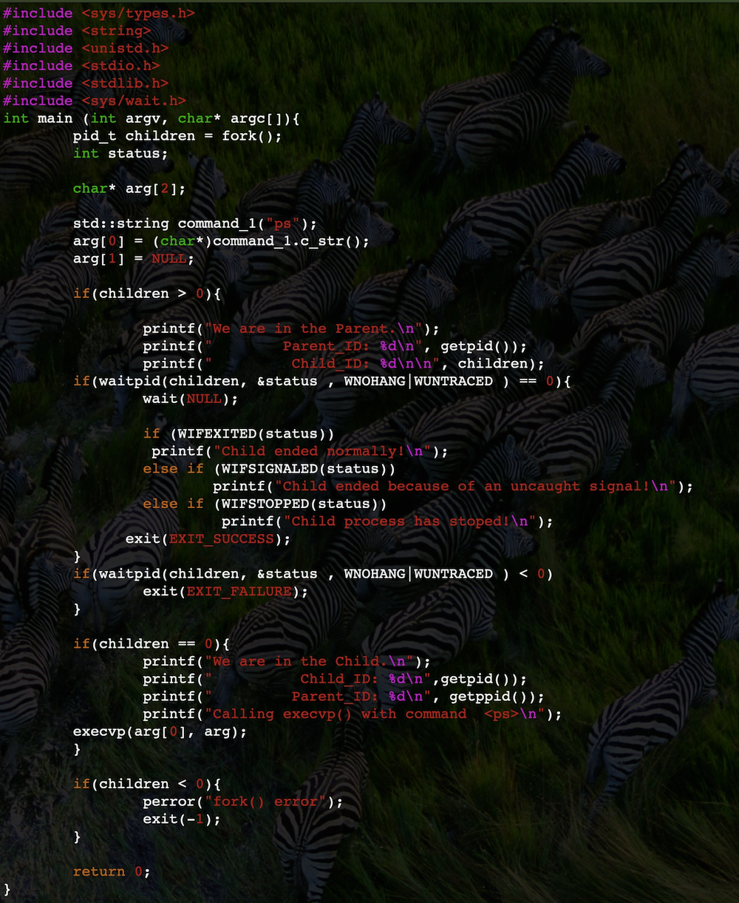
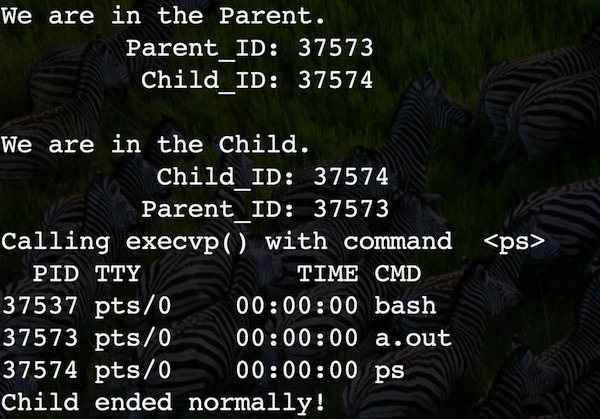

# CS 100 Programming Project
**Winter 2019**

William Montes SID: 862095355

Wesley DeVore	 SID: 862081656

# INTRODUCTION

This program is a command shell that will be able to take in commands from user input and execute them in the correct order while handling errors given by incorrect commands. This program will use a composite of connector and command objects stored in a tree to achieve this functionality. We will be using a parsing function to split up the user input into its commands, complete with any arguments for it being converted into a vector of strings and passed into the command constructor, and connectors which include and, or, and the semi-colon. These objects will be passed into a tree, and the tree will execute the commands by an in-order traversal through it with each connector evaluating the left node, then only evaluating the right node if necessary.

# UML DIAGRAM

# CLASS DESCRIPTION

**window**

The first class that our project will use will be the *window* class that generates the test box that the user interacts with and handles the input and output. 

**composite**

The group of classes that we are using will be part of a base that has the **compute()** function. This function be what is run throughout the tree to get the proper functionality.

The group goes into one of two classes, the *command* class and the *separator* class.

The *command* class is the class that holds the type of command being executed such as echo and ls and its **compute()** will excecute that command when called. This class will be constructed with a string and a vector of strings. The string will hold the type of command, like echo and ls, whereas the vector will hold the arguments that come with that command if any.

The *separator* class contains a left and right base child, and can be split into three subclasses of *and*, *or*, and *semiColon*. These classes inherit the **compute()** function from *separator*, but all three execute it in a different way. 

The *and* class will run **compute()** on its left child and only run right child if the left child **compute()** returns a positive. 

The *or* class will run **compute()** on its left child and only run right child if the left child **compute()** returns a negative. 

The *semiColon* class will always run its left child **compute()** and then its right child **compute()** if it has a right child.

# PROTOTYPE/RESEARCH
The fork(), waitpid(), and execvp() are system calls that provide services of the operating system to the user. 

The system call fork() is used to create necessary processes. This system call takes no arguments and will return a process ID and its purpose is to create a new process that in turn will become the child process of the caller/parent. After the creation of this child process both the parent and child processes will execute on the next instruction. This is why it is important to distinguish between the parent process and the child process, which is usually done testing the return value of fork(). Thus, when fork() returns a value < 0, the creation of a subprocess/child process was unsuccessful. If fork() returns a value > 0,  then this is the parent process. Lastly, if fork() returns 0, then the creation of the child process was successful. 

The system call execvp()  is part of the exec() family of functions that replace the current process image with a different image. Specifically, the function execvp() allows the caller to specify through an array of pointers with null terminating elements a list of commands available to the new program. For example, for the .cpp bellow execvp() is used with the command ps, which outputs to the console the information about any currently running processes.

# ROADMAP & ISSUES

- [ ] [Create the window class](https://github.com/cs100/assignment-cs-100-wes-will/issues/1#issue-406038491) 

- [ ] [Create the textbox that will handle i/o funcionality](https://github.com/cs100/assignment-cs-100-wes-will/issues/13#issue-406050156)

- [ ] [Create the base class](https://github.com/cs100/assignment-cs-100-wes-will/issues/4#issue-406038685)

- [ ] [Create the parsing function](https://github.com/cs100/assignment-cs-100-wes-will/issues/2#issue-406038594)

- [ ] [Create the command class and its compute() function](https://github.com/cs100/assignment-cs-100-wes-will/issues/6#issue-406038747)

- [ ] [Test the command class compute() function](https://github.com/cs100/assignment-cs-100-wes-will/issues/7#issue-406038798)

- [ ] [Create the connector class](https://github.com/cs100/assignment-cs-100-wes-will/issues/5#issue-406038698)

- [ ] [Create the and class](https://github.com/cs100/assignment-cs-100-wes-will/issues/8#issue-406038829)

- [ ] [Create the or class](https://github.com/cs100/assignment-cs-100-wes-will/issues/9#issue-406038852)

- [ ] [Create the semiColon class](https://github.com/cs100/assignment-cs-100-wes-will/issues/10#issue-406038892)

- [ ] [Test the and or and semiColon class for correct ordering](https://github.com/cs100/assignment-cs-100-wes-will/issues/11#issue-406038956)

- [ ] [Create the tree that holds base objects](https://github.com/cs100/assignment-cs-100-wes-will/issues/12#issue-406039017)
